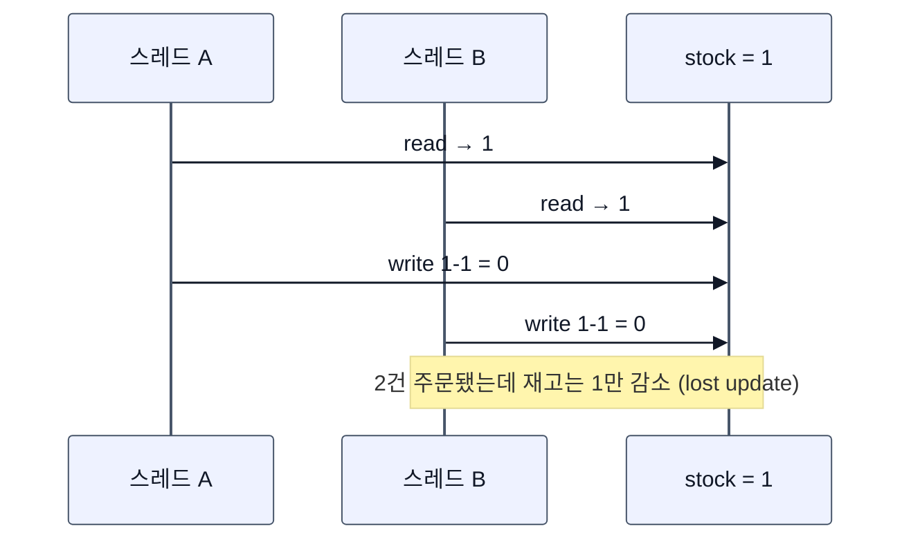
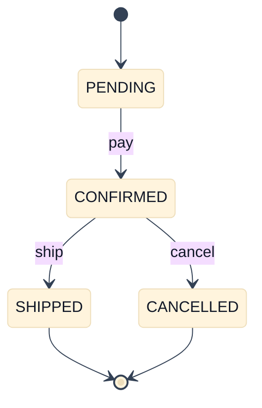
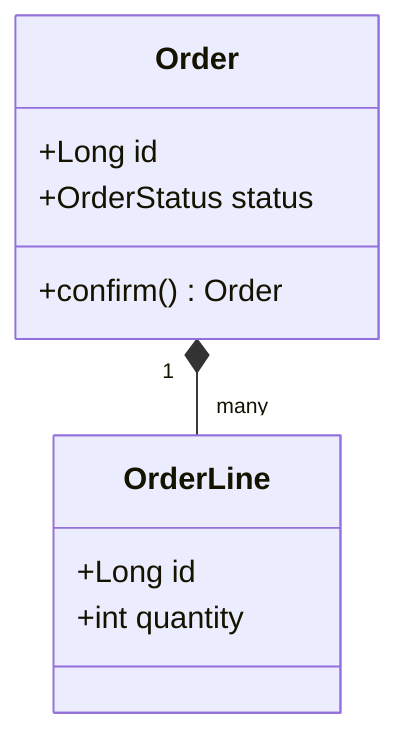
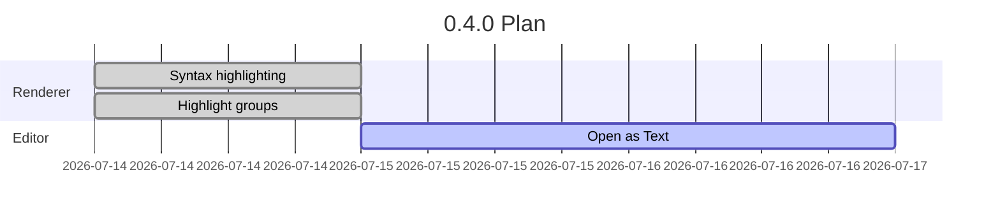
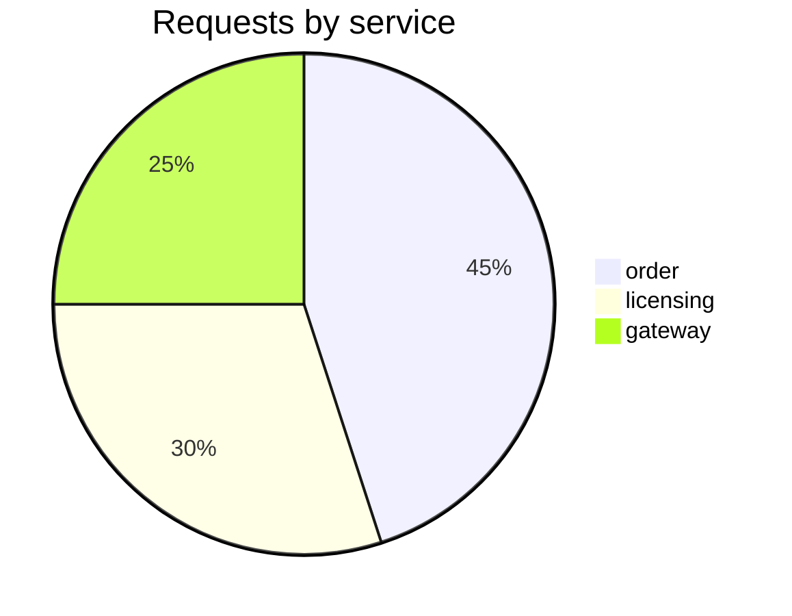

# Mermaid Representative Patterns

Representative diagram types beyond flowcharts. The sequence and state diagrams pin a white
background through frontmatter `themeVariables.background`, which must survive the dark viewer
theme; the rest follow the viewer theme.

## Sequence — race condition (white canvas via frontmatter)

## State — order lifecycle (white canvas via frontmatter)

## Class — domain model (viewer theme)

## Gantt — release plan (viewer theme)

## Pie — traffic share (viewer theme)

