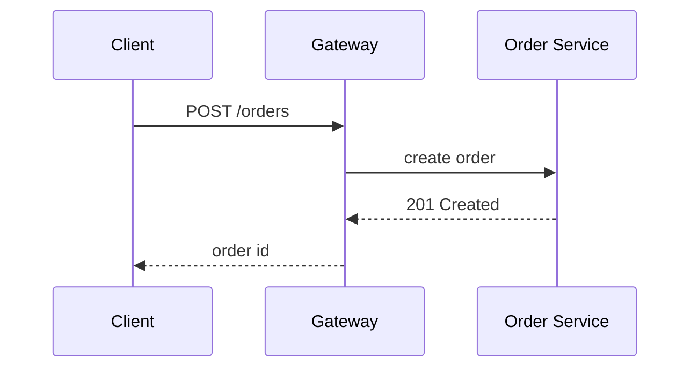
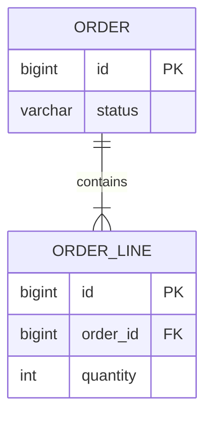

# Order Service Architecture Sample

ASCII-filename baseline for comparing against the non-ASCII samples. Includes tables, code, Mermaid diagrams, **bold emphasis**, and inline code such as `Order.confirm()`.

> Quote: every call behind the gateway is a **synchronous solid line**; events are *asynchronous dotted lines*.

## Components

| Area | Component | Role |
|---|---|---|
| Edge | API Gateway | Single entry point · routing · token validation |
| Business | Order Service | Order creation · state management |
| Storage | PostgreSQL / Redis | Persistence / read cache |
| Messaging | Kafka | Order event publish/subscribe |

### Checklist

- [x] ASCII path rendering
- [x] Remote icon diagrams
- [ ] Release 0.3.1

## Code Snippets

### Kotlin

```kotlin
data class Order(val id: Long, val status: OrderStatus) {
    fun confirm(): Order = copy(status = OrderStatus.CONFIRMED)
}
```

### TypeScript

```typescript
interface Order {
  id: number;
  status: "PENDING" | "CONFIRMED";
}

export const confirm = (order: Order): Order => ({ ...order, status: "CONFIRMED" });
```

### Python

```python
from dataclasses import dataclass, replace

@dataclass(frozen=True)
class Order:
    id: int
    status: str = "PENDING"

def confirm(order: Order) -> Order:
    return replace(order, status="CONFIRMED")
```

### YAML

```yaml
order-service:
  datasource:
    url: jdbc:postgresql://db:5432/orders
  kafka:
    topic: order-events
```

## Mermaid — Architecture (flowchart + remote icons)

```mermaid
---
config:
  theme: base
  darkMode: false
  themeVariables:
    background: "#ffffff"
    primaryTextColor: "#111827"
    lineColor: "#334155"
---
flowchart LR
  subgraph canvas[" "]
    direction LR
    client["Client"] --> gw["API Gateway"]
    gw --> order["Order Service"]
    order --> db@{ img: "https://icons.terrastruct.com/dev/postgresql.svg", label: "Order DB", pos: "b", h: 48, constraint: "on" }
    order --> cache@{ img: "https://cdn.simpleicons.org/redis/DC382D", label: "Read Cache", pos: "b", h: 48, constraint: "on" }
    order -. order events .-> kafka@{ img: "https://cdn.simpleicons.org/apachekafka/231F20", label: "Kafka", pos: "b", h: 48, constraint: "on" }
  end
  classDef icon fill:transparent,stroke:transparent,stroke-width:0px,color:#111827
  class db,cache,kafka icon
  style canvas fill:#ffffff,stroke:#ffffff,stroke-width:0px,color:#111827
```

## Mermaid — Sequence



## Mermaid — ERD



## Relative image


