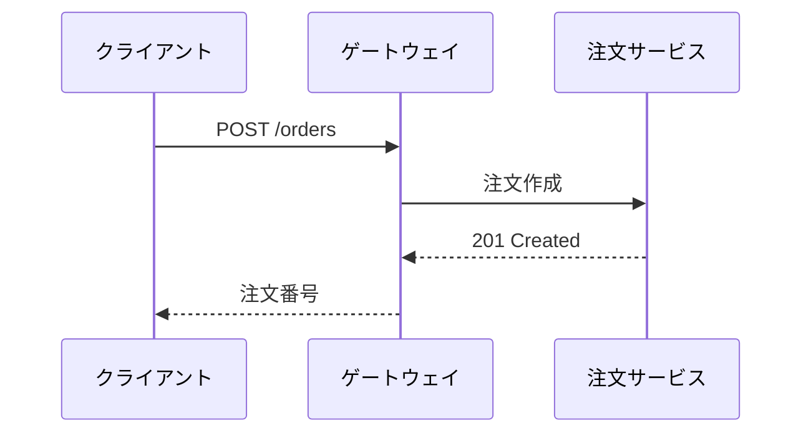
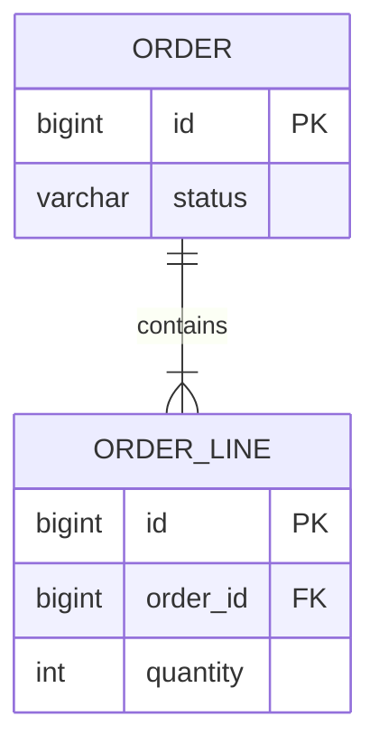

# 注文サービス アーキテクチャ サンプル

日本語ファイル名・日本語本文のレンダリング検証用ドキュメントです。表、コード、Mermaid ダイアグラムと**太字の強調**、`Order.confirm()` のようなインラインコードを含みます。

> 引用: ゲートウェイ以降の呼び出しは**同期の実線**、イベントは*非同期の点線*で表記する。

## 構成要素

| 領域 | コンポーネント | 役割 |
|---|---|---|
| エッジ | API Gateway | 単一エントリポイント · ルーティング · トークン検証 |
| ビジネス | 注文サービス | 注文作成 · 状態管理 |
| ストレージ | PostgreSQL / Redis | 永続化 / 参照キャッシュ |
| メッセージング | Kafka | 注文イベントの発行/購読 |

### チェックリスト

- [x] 日本語パスのレンダリング
- [x] リモートアイコンのダイアグラム
- [ ] リリース 0.3.1

## コードスニペット

### Kotlin

```kotlin
data class Order(val id: Long, val status: OrderStatus) {
    fun confirm(): Order = copy(status = OrderStatus.CONFIRMED)
}
```

### TypeScript

```typescript
interface Order {
  id: number;
  status: "PENDING" | "CONFIRMED";
}

export const confirm = (order: Order): Order => ({ ...order, status: "CONFIRMED" });
```

### Python

```python
from dataclasses import dataclass, replace

@dataclass(frozen=True)
class Order:
    id: int
    status: str = "PENDING"

def confirm(order: Order) -> Order:
    return replace(order, status="CONFIRMED")
```

### YAML

```yaml
order-service:
  datasource:
    url: jdbc:postgresql://db:5432/orders
  kafka:
    topic: order-events
```

## Mermaid — アーキテクチャ (flowchart + リモートアイコン)

```mermaid
---
config:
  theme: base
  darkMode: false
  themeVariables:
    background: "#ffffff"
    primaryTextColor: "#111827"
    lineColor: "#334155"
---
flowchart LR
  subgraph canvas[" "]
    direction LR
    client["クライアント"] --> gw["API Gateway"]
    gw --> order["注文サービス"]
    order --> db@{ img: "https://icons.terrastruct.com/dev/postgresql.svg", label: "注文 DB", pos: "b", h: 48, constraint: "on" }
    order --> cache@{ img: "https://cdn.simpleicons.org/redis/DC382D", label: "参照キャッシュ", pos: "b", h: 48, constraint: "on" }
    order -. 注文イベント .-> kafka@{ img: "https://cdn.simpleicons.org/apachekafka/231F20", label: "Kafka", pos: "b", h: 48, constraint: "on" }
  end
  classDef icon fill:transparent,stroke:transparent,stroke-width:0px,color:#111827
  class db,cache,kafka icon
  style canvas fill:#ffffff,stroke:#ffffff,stroke-width:0px,color:#111827
```

## Mermaid — シーケンス



## Mermaid — ERD



## 相対パスの画像


