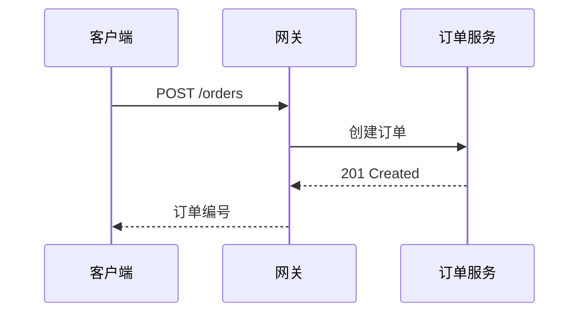
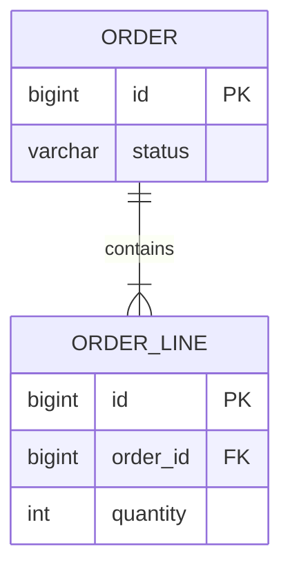

# 订单服务架构示例

用于验证中文文件名与中文正文渲染的文档。包含表格、代码、Mermaid 图、**粗体强调**以及 `Order.confirm()` 这样的行内代码。

> 引用: 网关之后的所有调用使用**同步实线**，事件使用*异步虚线*表示。

## 组成部分

| 领域 | 组件 | 职责 |
|---|---|---|
| 边缘 | API Gateway | 单一入口 · 路由 · 令牌校验 |
| 业务 | 订单服务 | 创建订单 · 状态管理 |
| 存储 | PostgreSQL / Redis | 持久化 / 查询缓存 |
| 消息 | Kafka | 订单事件的发布/订阅 |

### 清单

- [x] 中文路径渲染
- [x] 远程图标的图表
- [ ] 发布 0.3.1

## 代码片段

### Kotlin

```kotlin
data class Order(val id: Long, val status: OrderStatus) {
    fun confirm(): Order = copy(status = OrderStatus.CONFIRMED)
}
```

### TypeScript

```typescript
interface Order {
  id: number;
  status: "PENDING" | "CONFIRMED";
}

export const confirm = (order: Order): Order => ({ ...order, status: "CONFIRMED" });
```

### Python

```python
from dataclasses import dataclass, replace

@dataclass(frozen=True)
class Order:
    id: int
    status: str = "PENDING"

def confirm(order: Order) -> Order:
    return replace(order, status="CONFIRMED")
```

### YAML

```yaml
order-service:
  datasource:
    url: jdbc:postgresql://db:5432/orders
  kafka:
    topic: order-events
```

## Mermaid — 架构 (flowchart + 远程图标)

```mermaid
---
config:
  theme: base
  darkMode: false
  themeVariables:
    background: "#ffffff"
    primaryTextColor: "#111827"
    lineColor: "#334155"
---
flowchart LR
  subgraph canvas[" "]
    direction LR
    client["客户端"] --> gw["API Gateway"]
    gw --> order["订单服务"]
    order --> db@{ img: "https://icons.terrastruct.com/dev/postgresql.svg", label: "订单 DB", pos: "b", h: 48, constraint: "on" }
    order --> cache@{ img: "https://cdn.simpleicons.org/redis/DC382D", label: "查询缓存", pos: "b", h: 48, constraint: "on" }
    order -. 订单事件 .-> kafka@{ img: "https://cdn.simpleicons.org/apachekafka/231F20", label: "Kafka", pos: "b", h: 48, constraint: "on" }
  end
  classDef icon fill:transparent,stroke:transparent,stroke-width:0px,color:#111827
  class db,cache,kafka icon
  style canvas fill:#ffffff,stroke:#ffffff,stroke-width:0px,color:#111827
```

## Mermaid — 时序图



## Mermaid — ERD



## 相对路径图片


