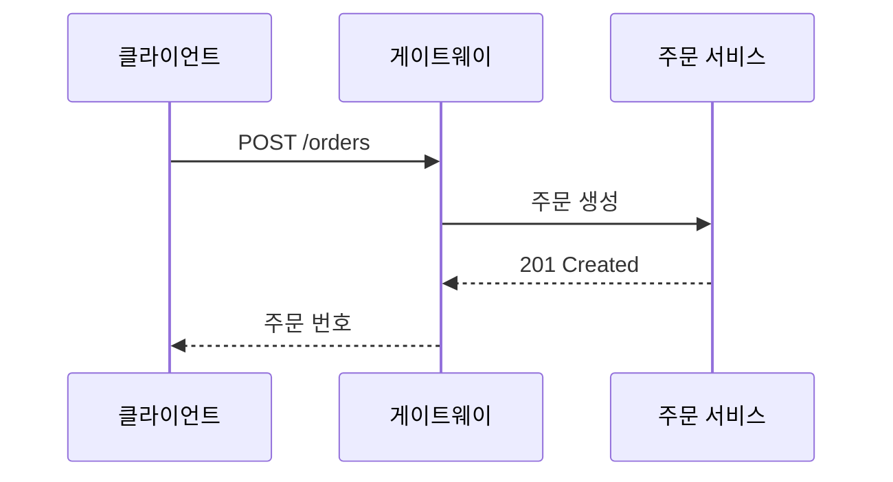
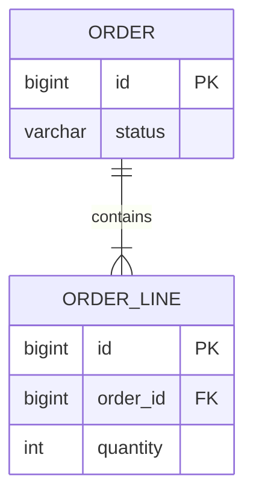

# 주문 서비스 아키텍처 샘플

한글 파일명·한글 본문 렌더링 검증용 문서입니다. 표, 코드, Mermaid 다이어그램과 **볼드 강조**, `Order.confirm()` 같은 인라인 코드를 포함합니다.

> 인용: 게이트웨이 뒤의 모든 호출은 **동기 실선**, 이벤트는 *비동기 점선*으로 표기한다.

## 구성 요소

| 영역 | 컴포넌트 | 역할 |
|---|---|---|
| 엣지 | API Gateway | 단일 진입점 · 라우팅 · 토큰 검증 |
| 비즈니스 | 주문 서비스 | 주문 생성 · 상태 관리 |
| 저장소 | PostgreSQL / Redis | 영속화 / 조회 캐시 |
| 메시징 | Kafka | 주문 이벤트 발행/구독 |

### 체크리스트

- [x] 한글 경로 렌더링
- [x] 원격 아이콘 다이어그램
- [ ] 릴리스 0.3.1

## 코드 스니펫

### Kotlin

```kotlin
data class Order(val id: Long, val status: OrderStatus) {
    fun confirm(): Order = copy(status = OrderStatus.CONFIRMED)
}
```

### TypeScript

```typescript
interface Order {
  id: number;
  status: "PENDING" | "CONFIRMED";
}

export const confirm = (order: Order): Order => ({ ...order, status: "CONFIRMED" });
```

### Python

```python
from dataclasses import dataclass, replace

@dataclass(frozen=True)
class Order:
    id: int
    status: str = "PENDING"

def confirm(order: Order) -> Order:
    return replace(order, status="CONFIRMED")
```

### YAML

```yaml
order-service:
  datasource:
    url: jdbc:postgresql://db:5432/orders
  kafka:
    topic: order-events
```

## Mermaid — 아키텍처 (flowchart + 원격 아이콘)

```mermaid
---
config:
  theme: base
  darkMode: false
  themeVariables:
    background: "#ffffff"
    primaryTextColor: "#111827"
    lineColor: "#334155"
---
flowchart LR
  subgraph canvas[" "]
    direction LR
    client["클라이언트"] --> gw["API Gateway"]
    gw --> order["주문 서비스"]
    order --> db@{ img: "https://icons.terrastruct.com/dev/postgresql.svg", label: "주문 DB", pos: "b", h: 48, constraint: "on" }
    order --> cache@{ img: "https://cdn.simpleicons.org/redis/DC382D", label: "조회 캐시", pos: "b", h: 48, constraint: "on" }
    order -. 주문 이벤트 .-> kafka@{ img: "https://cdn.simpleicons.org/apachekafka/231F20", label: "Kafka", pos: "b", h: 48, constraint: "on" }
  end
  classDef icon fill:transparent,stroke:transparent,stroke-width:0px,color:#111827
  class db,cache,kafka icon
  style canvas fill:#ffffff,stroke:#ffffff,stroke-width:0px,color:#111827
```

## Mermaid — 시퀀스



## Mermaid — ERD



## 상대 경로 이미지


