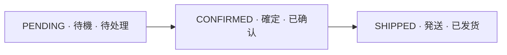

# 혼합 · ミックス · 混合 — Mixed Language Sample

파일명에 이모지·공백·`%`·한글·일본어·중국어가 섞인 극단 케이스입니다. 본문도 세 언어를 섞어 **볼드**와 `inline.code()` 렌더링을 확인합니다.

## 한국어 — 개요

주문 서비스는 게이트웨이 뒤에서 **동기 호출**을 받고, 이벤트는 *비동기*로 발행한다.

```kotlin
fun 주문확정(order: Order): Order = order.copy(status = OrderStatus.CONFIRMED)
```

## 日本語 — 概要

注文サービスはゲートウェイの背後で**同期呼び出し**を受け、イベントは*非同期*で発行する。

```typescript
const 注文確定 = (order: Order): Order => ({ ...order, status: "CONFIRMED" });
```

## 中文 — 概述

订单服务在网关之后接收**同步调用**，事件以*异步*方式发布。

```python
def 确认订单(order: Order) -> Order:
    return replace(order, status="CONFIRMED")
```

## Mermaid — 3개 언어 라벨 flowchart

```mermaid
---
config:
  theme: base
  darkMode: false
  themeVariables:
    background: "#ffffff"
    primaryTextColor: "#111827"
    lineColor: "#334155"
---
flowchart LR
  subgraph canvas[" "]
    direction LR
    ko["주문 서비스"] --> ja["注文サービス"] --> zh["订单服务"]
    zh -. 이벤트 · イベント · 事件 .-> kafka@{ img: "https://cdn.simpleicons.org/apachekafka/231F20", label: "", pos: "b", h: 48, constraint: "on" }
  end
  classDef icon fill:transparent,stroke:transparent,stroke-width:0px,color:#111827
  class kafka icon
  style canvas fill:#ffffff,stroke:#ffffff,stroke-width:0px,color:#111827
```

## Mermaid — 상태 흐름 (flowchart 표현)


